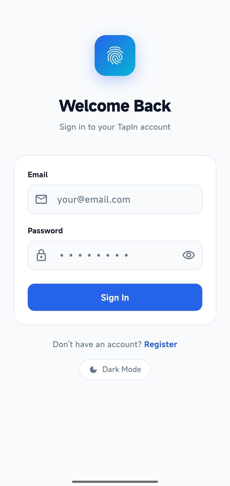
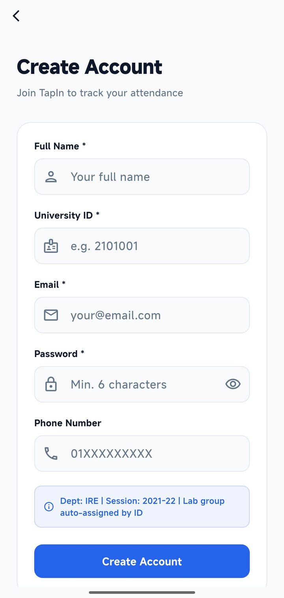
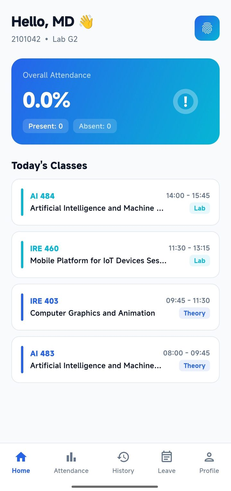
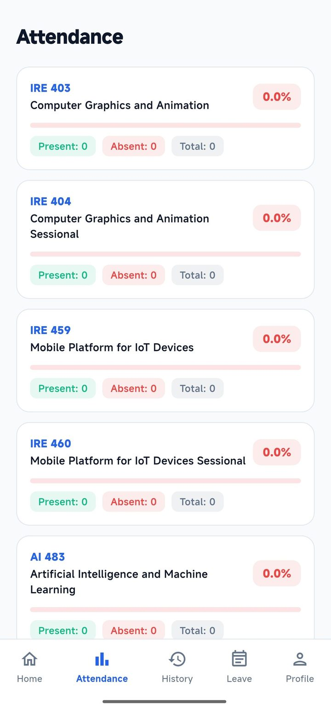
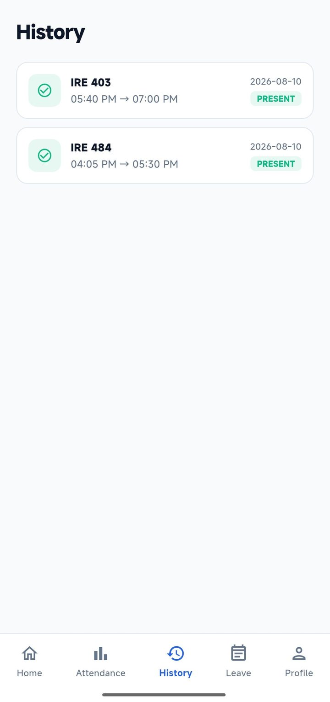
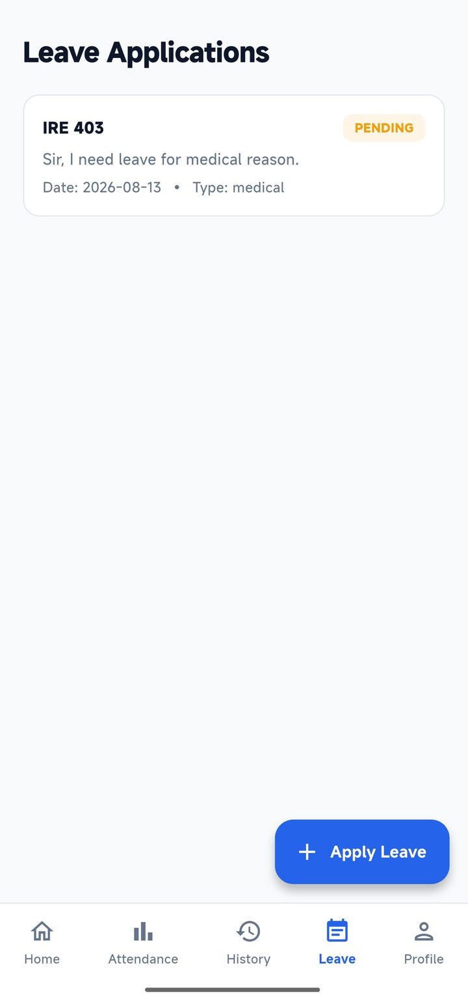
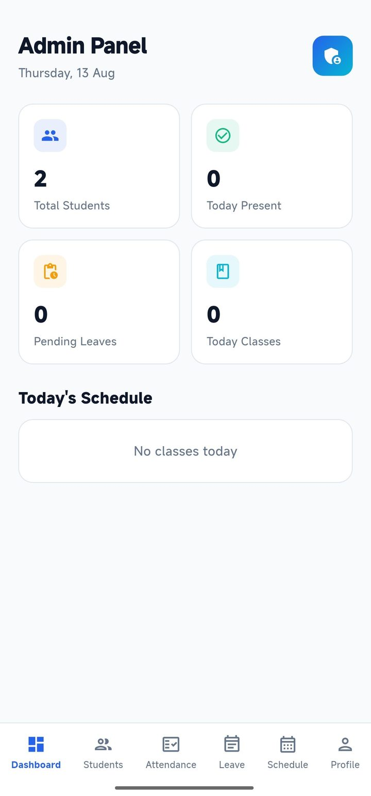
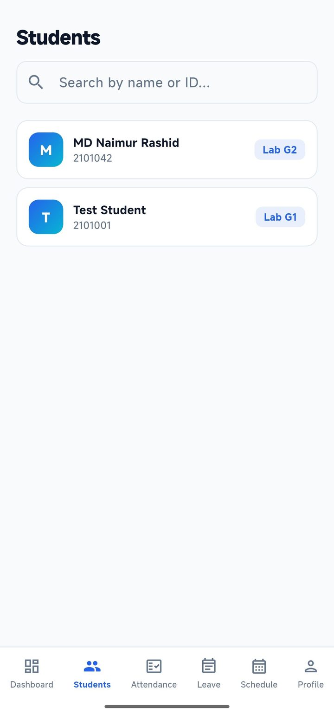
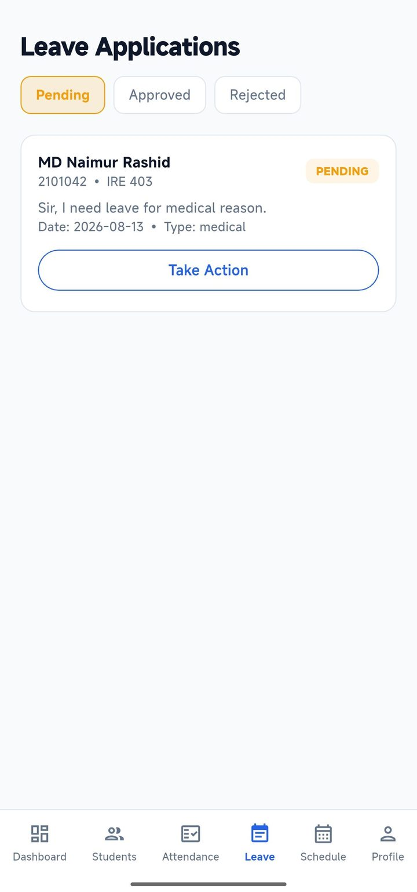
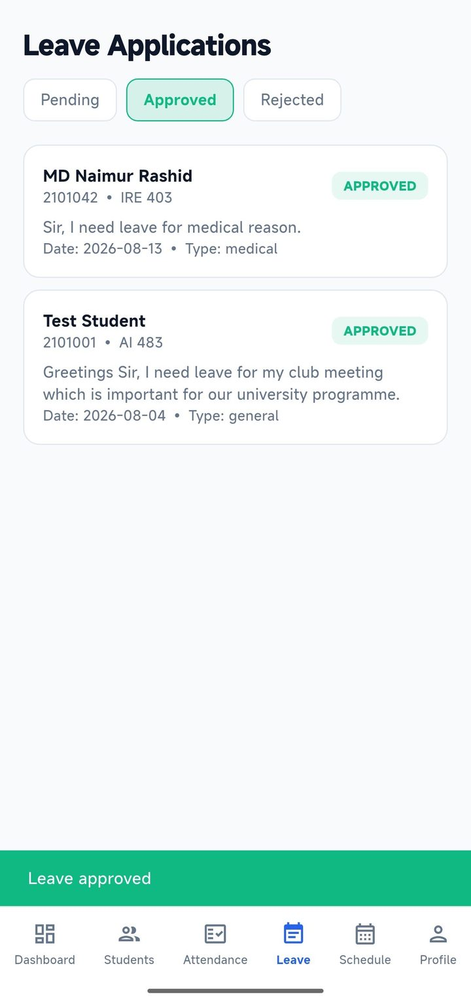

# TapIn — Smart Attendance System

A Flutter-based IoT-integrated smart attendance management system for universities. Students tap their RFID card on a NodeMCU device in the classroom, and attendance is recorded automatically in a cloud database (Supabase) in real time.

---

## Features

### Student
- View today's class schedule based on department, section, and lab group
- Track overall and per-subject attendance percentage with visual progress bars
- View full attendance history (last 50 records) with entry/exit times
- Apply for leave (Medical / General / Emergency) with subject and date selection
- View leave application status and admin notes
- Light / Dark mode support

### Admin
- Dashboard with key stats: total students, today's present count, pending leaves, today's classes
- View and search all registered students by name or university ID
- View individual student attendance stats and eligibility (attendance mark secured or not)
- Assign RFID card UID to each student profile
- View and filter attendance records by date, manually update attendance status (Present / Absent / Condoned)
- Approve or reject student leave applications with optional notes
- View full weekly class schedule by day

---

## Technology Stack

| Layer | Technology |
|---|---|
| Mobile App | Flutter (Dart) |
| Backend & Database | Supabase (PostgreSQL + Auth + Edge Functions) |
| IoT Hardware | NodeMCU ESP8266 |
| RFID Reader | RC522 (MFRC522) |
| PDF Reports | pdf + printing packages |
| Local Storage | shared_preferences (dark mode) |

---

## Hardware Setup (NodeMCU + RC522)

### Pin Connections

| RC522 Pin | NodeMCU Pin | Label |
|---|---|---|
| SDA (SS) | GPIO 15 | D8 |
| RST | GPIO 0 | D3 |
| MOSI | GPIO 13 | D7 |
| MISO | GPIO 12 | D6 |
| SCK | GPIO 14 | D5 |
| GND | GND | GND |
| 3.3V | 3.3V | 3V3 |

### Arduino Code
The NodeMCU sketch is located at:
```
assets/nodemcucode/nodemcucode.ino
```
It connects to WiFi, reads the RFID card UID, and sends it via HTTP POST to a Supabase Edge Function which records the attendance.

---

## Database Tables (Supabase)

| Table | Purpose |
|---|---|
| `users` | Student and admin profiles, includes `rfid_uid` field |
| `subjects` | Academic subjects with name and code |
| `class_schedules` | Weekly timetable (day, time, theory/lab) |
| `attendance_logs` | Individual attendance records (entry/exit/status) |
| `leave_applications` | Student leave requests and admin decisions |

---

## Project Structure

```
lib/
├── main.dart                        # App entry point, theme management
├── core/
│   ├── constants/app_constants.dart # App-wide constants (Supabase keys, rules)
│   └── theme/app_theme.dart         # Light and Dark theme definitions
└── presentation/
    └── screens/
        ├── auth/
        │   ├── splash_screen.dart   # Animated launch + auth routing
        │   ├── login_screen.dart    # Email/password login
        │   └── register_screen.dart # Student self-registration
        ├── student/
        │   └── student_home.dart    # Student app (5 tabs)
        └── admin/
            └── admin_home.dart      # Admin app (6 tabs)
```

---

## Getting Started

### Prerequisites
- Flutter SDK (stable channel)
- Android Studio or VS Code
- A Supabase project with the required tables and Edge Function deployed

### Run the App

```bash
flutter pub get
flutter run
```

### Build Release APK

```bash
flutter build apk --release
```
APK will be generated at: `build/app/outputs/flutter-apk/app-release.apk`

### Custom App Icon

Place your icon PNG at `assets/icon.png` and run:
```bash
flutter pub run flutter_launcher_icons
```

---

## Business Rules

- **Attendance threshold:** 90% minimum to secure full attendance marks (30/30)
- **Lab group auto-assignment:** Based on the last 3 digits of university ID (≤ 25 → G1, > 25 → G2)
- **RFID linking:** Admin must assign an RFID card UID to each student before hardware attendance works
- **Condoned absences:** When admin approves a leave, the attendance status is automatically updated to `condoned`
- **Academic week:** Saturday to Thursday (Bangladesh university schedule)

---

## Department & Session

This version is configured for:
- **Department:** IRE
- **Session:** 2021-22

---

## Full Documentation

For complete project documentation including all screen details, Supabase schema, NodeMCU code flow, and class descriptions, see:

📄 [Project_Document.md](Project_Document.md)

---

## App Screens

<div align="center">

### Authentication
| Login | Register |
|:---:|:---:|
|  |  |

### Student View
| Dashboard | Attendance | History | Leave |
|:---:|:---:|:---:|:---:|
|  |  |  |  |

### Admin View
| Dashboard | Students | Leave Pending | Leave Approved | Schedule |
|:---:|:---:|:---:|:---:|:---:|
|  |  |  |  |  |

</div>

---

## Creator

<div align="center">


### MD Naimur Rashid

[](https://naimurrashid.dev/)
[](https://github.com/naimurhamim)

</div>
